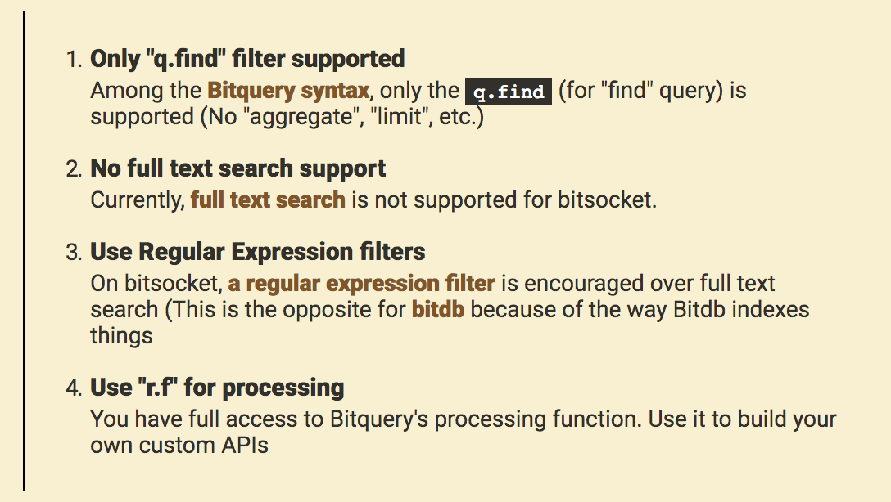

# Bitplaylist

A community powered repository of Bitquery examples. You are very welcome to send a pull request if you have a useful query.

This repository is made up of two categories:

1. Bitdb
2. Bitsocket

Both [bitdb](https://bitdb.network) and [bitsocket](https://bitsocket.org) use [Bitquery](https://docs.bitdb.network/docs/query_v3) as the query language, so you can use exactly the same query to fetch (BitDB) AND monitor (Bitsocket) the blockchain.

However Bitsocket supports a subset of Bitquery. Specifically:

# Examples

- [BitDB Examples](./bitdb/README.md)
- [BitSocket Examples](./bitsocket/README.md)

